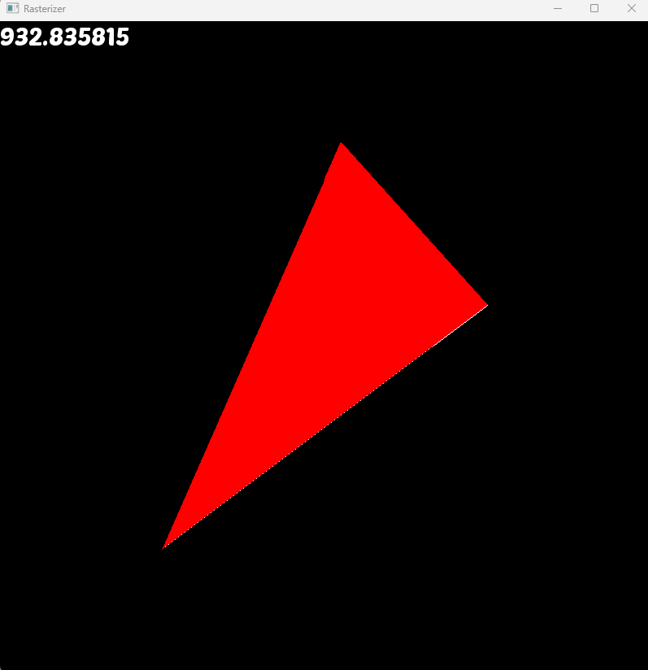
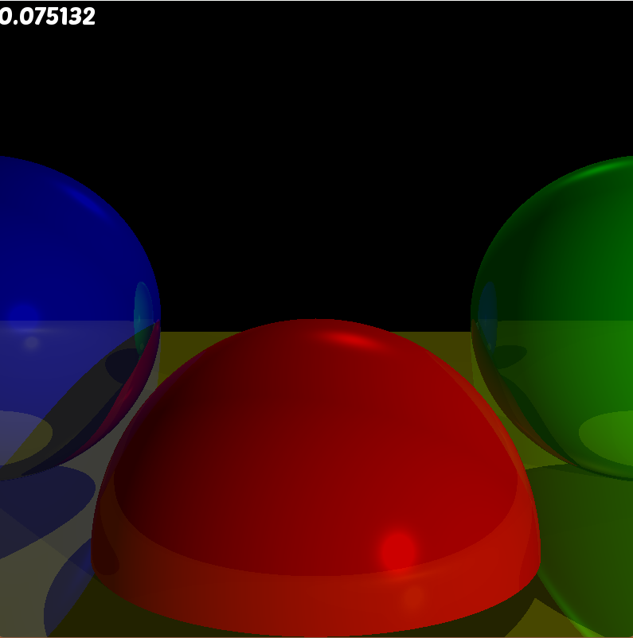

# Computer Graphics from Scratch

A personal implementation of the concepts and techniques presented in ***Computer Graphics from Scratch: A Programmer's Introduction to 3D Rendering*** by **Gabriel Gambetta**.

This project is mainly a way for me to follow along with the book, implement the algorithms myself, and get a better understanding of how computer graphics and 3D rendering work under the hood.

## Showcase

### Rasterizer

### Ray Tracer

## What I'm Learning

The project follows the progression of the book, implementing graphics techniques from the ground up rather than relying on a graphics engine to handle the rendering.

Some of the concepts explored include:

* 2D and 3D coordinate systems
* Vector and matrix mathematics
* Transformations and projections
* Triangle rasterization
* Lighting and shading
* 3D object rendering
* Ray tracing
* Reflections and shadows

## Purpose

The goal of this project isn't to create a production-ready renderer. It's primarily a learning project.

I'm using it to understand **what actually happens between having a 3D scene and getting pixels on the screen**, while practicing the mathematics and programming techniques involved in graphics programming.

## Credits

The concepts and progression of this project are based on:

**Gabriel Gambetta — *Computer Graphics from Scratch: A Programmer's Introduction to 3D Rendering***

This repository is my own implementation while following along with the book. The book itself is the work of Gabriel Gambetta.
